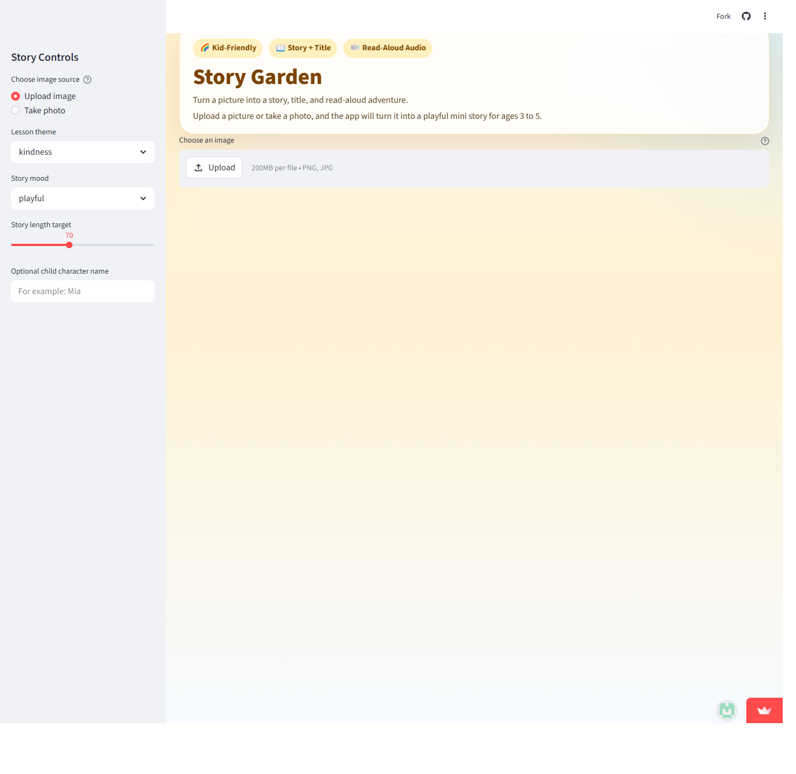

# Story Garden

Story Garden is an interactive Streamlit application built for young children.  
It turns a child-friendly image into a short title, a warm mini story for children aged 3 to 5, and a read-aloud audio version.

## Project Goal

The goal of this project is to build a multimodal storytelling app that:

- understands an uploaded image
- creates a simple and safe children's story
- converts the story into speech
- provides a playful and easy-to-use interface for children and parents

This app is designed around the needs of young children, so the generated story is short, gentle, and easy to follow.

## Main Features

- Upload an image from the computer
- Take a photo directly with the camera
- Generate an image caption automatically
- Generate a short story in simple English for children aged 3 to 5
- Control story style through lesson theme and mood
- Generate a short title based on the uploaded image
- Convert the story into read-aloud audio
- Add natural pauses between sentences in the audio
- Highlight the approximate current word during playback
- Change playback speed with built-in speed buttons

## Live App

- Streamlit Cloud URL: [Story Garden](https://2026spring5240-jhwpdi3ygb9suxcgvfpram.streamlit.app)

If the deployment URL changes after a redeploy, update this section before sharing the project.

## App Preview



## Tech Stack

- Python 3.11
- Streamlit
- Hugging Face Transformers
- PyTorch
- NumPy
- Pillow

## Models Used

- Image Captioning: `Salesforce/blip-image-captioning-base`
- Story Generation: `google/flan-t5-small`
- Text-to-Speech: `Matthijs/mms-tts-eng`

## Project Structure

```text
2026Spring5240-git/
|- app.py
|- requirements.txt
|- README.md
|- app_core/
|  |- __init__.py
|  |- audio_utils.py
|  |- config.py
|  |- pipelines.py
|  |- story_utils.py
|  |- ui.py
```

## File Description

- `app.py`
  Main Streamlit entry point. It controls the top-level workflow from image input to final story and audio output.

- `app_core/config.py`
  Stores shared configuration values such as model names, supported file types, and story length limits.

- `app_core/pipelines.py`
  Handles model loading, image caption generation, story generation, temporary file saving, and text-to-speech generation.

- `app_core/story_utils.py`
  Contains prompt design, output cleanup, fallback story logic, and image title generation.

- `app_core/audio_utils.py`
  Converts generated audio into WAV format and renders the custom audio player with transcript highlighting.

- `app_core/ui.py`
  Contains the Streamlit layout, styles, sidebar controls, and result section helpers.

## How to Run Locally

1. Install Python 3.11.
2. Install the required packages:

```bash
pip install -r requirements.txt
```

3. Start the Streamlit app:

```bash
streamlit run app.py
```

## How to Use the App

1. Upload an image or take a photo.
2. Select a lesson theme.
3. Select a story mood.
4. Adjust the target story length if needed.
5. Optionally enter a child character name.
6. Click `Create story and audio`.
7. Read the story and play the generated audio.

## Design Notes

- The story is intentionally kept short to match the attention span of young children.
- The prompt design focuses on child-safe language, simple structure, and positive emotional tone.
- The code is split into multiple modules to improve readability, modularity, and maintainability.
- The text-to-speech pipeline inserts short pauses between sentences so the narration sounds more natural.

## Project Packaging

Because this project uses multiple Python files, it should not be shared with only `app.py`.  
To run correctly, the project also needs the supporting files inside `app_core`.

### Core Files

- `app.py`
- `requirements.txt`
- full `app_core/` folder
- Streamlit Cloud URL

### Recommended File

- `README.md`

If you package the project as source code or a zip file, include all of the files above in the same project folder.

## Deployment Checklist

Before sharing or deploying the project, make sure:

- `app.py` is included
- `requirements.txt` is included
- the full `app_core/` folder is included
- the Streamlit Cloud URL is provided
- the app opens successfully
- image upload works
- camera input works
- image caption generation works
- story generation works
- audio generation works
- audio playback works
- the story is suitable for children aged 3 to 5
- the story uses simple and child-friendly language
- the story length stays within the assignment target range
- the app is deployed correctly on Streamlit Cloud
- the main file path is set to `app.py`

## Final Notes

This project was built to balance both technical quality and user experience:

- modular code structure for easier development
- clear code comments
- a working Streamlit interface
- image-to-text generation
- text-to-story generation
- story-to-audio generation

The current version is suitable as a polished storytelling prototype and can be further extended with quiz features, vocabulary cards, or more interactive storytelling options in the future.
